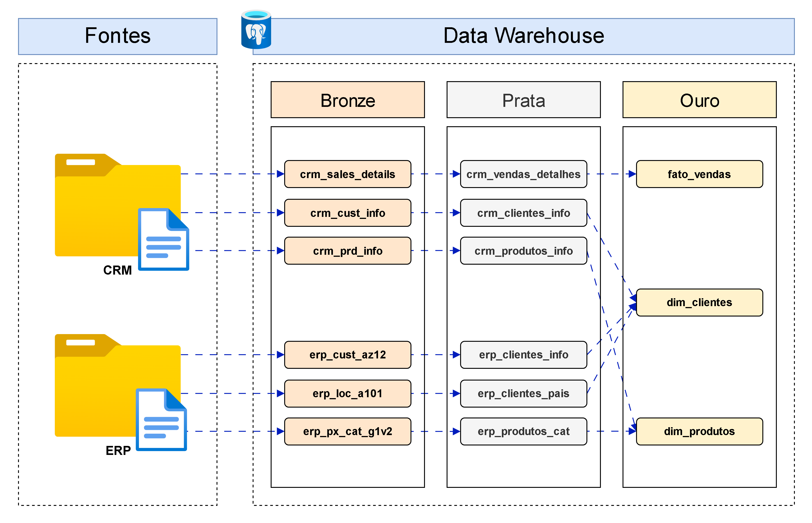
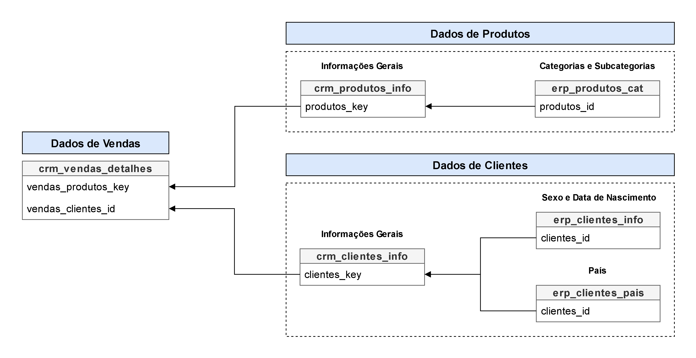
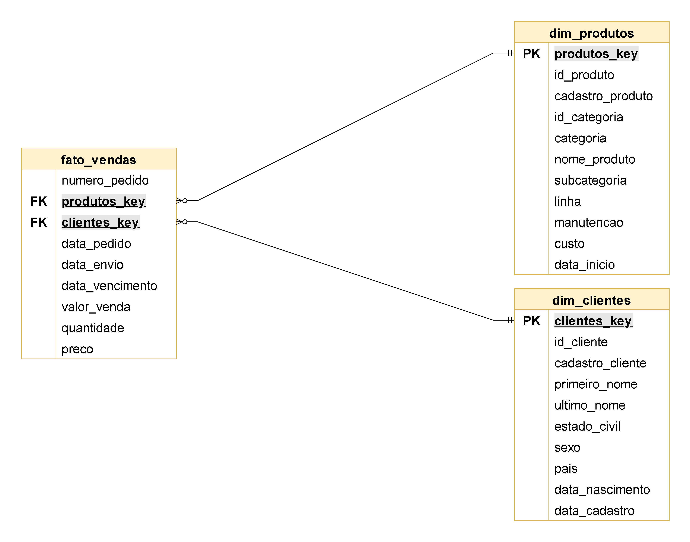

# **Meu primeiro Data Warehouse**

Este projeto tem como objetivo demonstrar boa parte das minhas habilidades práticas de engenharia de dados em um cenário real de construção de um data warehouse.

## :bulb: **Sobre o projeto**

Neste projeto farei a construção de um pipeline moderno e completo, utilizando o PostgreSQL, para consolidar e preparar dados de vendas, possibilitando a elaboração de análises interativas que gerem insights acionáveis. Para atingir este objetivo, listei as principais especificações deste projeto:

- **Fonte dos Dados**: Fazer o *import* de arquivos originados de sistemas comuns de empresas (ERP, CRM, SAP, Intranet e entre outros) em formato CSV;
- **Qualidade dos Dados**: Garantir a alta qualidade dos dados através de limpeza, padronização, normalização e transformação dos dados;
- **Integração**: Fazer a integração de dados de diversas fontes através de uma modelagem de dados, disponibilizando dados de alta qualidade e com regras de negócio aplicadas;
- **Escopo**: Focar somente na versão mais atualizada dos dados. Isto é, não será necessário ter um histórico de dados;
- **Documentação**: Disponibilizar uma documentação clara do projeto para stakeholders.

## 🏗️ **Arquitetura**

Neste projeto será utilizada a Arquitetura de Dados Medalhão, em que são definidas as camadas **Bronze**, **Prata** e **Ouro**:


### **Camadas**

1. **Bronze**: Nesta camada temos os dados brutos, da maneira que vieram da fonte de dados. Basicamente, são arquivos CSV que serão inseridos em uma base de dados do PostgreSQL.
2. **Prata**: Nesta camada faremos a limpeza, padronização e normalização dos dados, criaremos colunas derivadas e faremos um enriquecimento dos dados.
3. **Ouro**: Nesta camada iremos aplicar regras de negócio aos dados, faremos uma modelagem do tipo Star Schema e nos responsabilizamos de preparar os dados para que os stakeholders possam consumir e tirar insights.

## :page_with_curl: **Convenções**

### **Tabelas**

#### **Regras Gerais**

Todas os nomes de tabelas, não importando em qual camada estejam, deverão seguir as seguintes regras:

- Ser em língua portuguesa, exceto na camada bronze.
- Seguir a convenção *snake_case*, que é uma convenção onde todas as letras são minúsculas e a separação de palavras é feita por underscore. A seguir, estão alguns exemplos:
    - `crm_corretores`.
    - `intranet_visitas_assessores`.
- Não utilizar comandos em SQL.
- Não utilizar acentos.

#### **Camada Bronze**

- Todos os nomes de tabelas nesta camada devem seguir as seguintes regras:
    - Começar com o nome do sistema de origem (e.g., `crm` , `intranet`).
    - Finalizar com o nome da tabela no sistema de origem (e.g., se no intranet há uma fonte de dados escrita “Visitas de Assessores”, então esta tabela na camada bronze se chamaria `intranet_visitas_assessores` ).
    - Em síntese, a nomeação de tabelas nesta camada deverão seguir a seguinte ideia `<nome do sistema de origem>_<nome desta fonte de dados neste sistema de origem>`.

#### **Camada Prata**

- Todos os nomes de tabelas nesta camada devem seguir as seguintes regras:
    - Ser em língua portuguesa.
    - Seguir as regras da camada bronze.

#### **Camada Ouro**

- Todos os nomes de tabelas nesta camada devem seguir as seguintes regras:
    - Começar com a classificação dela na modelagem de dados (e.g., `fato` , `dim`, `agg`).
    - Finalizar com um nome que descreva bem o conteúdo da tabela (e.g., `corretores`, `visitas`, `vendas`).
    - Alguns exemplos: `fato_vendas`, `dim_corretores`, `dim_calendario`, `dim_fornecedores`, `agg_visitas`, `agg_comercial`, `agg_clientes`.

### **Colunas**

#### **Regras Gerais**

- Todos os nomes de colunas, não importando o tipo de coluna, devem seguir as seguintes regras:
    - Seguir a convenção *snake_case*.
    - Não utilizar comandos em SQL.
    - Não utilizar acentos.

#### **Chave Primária**

- Todos os nomes de colunas de chave primária em tabelas dimensão deverão ter o sufixo `_key`;
- `<nome da tabela>_key`:
    - `<nome da tabela>` se refere ao nome da tabela dimensão.
    - `_key` se refere ao sufixo de chave primária.
    - Exemplos: `clientes_key`, `corretores_key`.

#### **Colunas Técnicas**

- Todos os nomes de colunas técnicas deverão começar com o prefixo `dwh_`, seguido de um nome que descreva bem a coluna;
- `dwh_<nome da coluna>`:
    - `<nome da coluna>` se refere a um nome que descreva bem o papel da coluna.
    - `dwh_` se refere ao prefixo utilizado para colunas com informações técnicas de sistema (e.g., hora da inserção dos dados, data da inserção dos dados).
    - Exemplos: `dwh_hora_carregamento`, `dwh_data_carregamento`.

### **Procedimentos Armazenados**

- Todos os nomes de procedimentos armazenados, *stored procedures* em inglês, utilizados para carregar os dados deverão começar com o prefixo `load_`, seguido do nome da camada em que os dados estão sendo carregados (e.g., `load_bronze`, `load_prata` ou `load_ouro`)

## :arrow_right: **Fluxo, Integração e Modelagem de Dados**

Após uma etapa de análise dos dados, foi idealizado o seguinte fluxo de dados e arranjo de tabelas e views. Em síntese, na camada bronze, a ideia é trazer o dado bruto e não mexer nada neste dado, nem mesmo no nome da tabela. Seguindo o fluxo, quando este dado chega na camada prata é realizada uma limpeza e uma série de padronizações, além de traduzir todos os nomes de tabelas e colunas para o português. Após isto, seguindo o fluxo dos dados para a camada ouro, é feita uma integração e modelagem utilizando as tabelas da camada prata.



Na camada prata já foi possível compreender de uma melhor maneira como as tabelas se relacionam entre si e, com isso, maneiras de agregá-las e integrá-las. Também nesta etapa de integração dos dados foi percebida uma melhor riqueza dos dados originados do CRM, em comparação com os dados originados do ERP. Entretanto, os dados do CRM foram os que mais precisaram ser limpos e padronizados.



Na camada ouro, adotamos uma modelagem de dados do tipo *star schema*, que se encaixa muito bem para o propósito deste Data Warehouse. Temos uma tabela fato com os dados transacionais de vendas com duas chaves estrangeiras que conectam com as duas tabelas dimensão de produtos e clientes.

As conexões entre tabelas são do tipo *1 Mandatory to Many Optional*, ou seja:
- Em relação aos produtos:
    - Pode haver produtos que não foram vendidos ainda.
    - Pode haver produtos que foram vendidos uma única vez.
    - Pode haver produtos que foram vendidos mais de uma vez.

- Em relação aos clientes:
    - Pode haver clientes que não compraram ainda.
    - Pode haver clientes que compraram uma única vez.
    - Pode haver clientes que compraram mais de uma vez.



Uma das etapas mais importantes após a criação de um Data Warehouse é a de disponibilizar uma documentação clara do que é exatamente cada dado de cada tabela. Estou me referindo à criação de um catálogo de dados, algo que traz mais clareza e até mesmo insights para os stakeholders.

### **Dimensão Produtos**
- **Conteúdo desta tabela**: Esta tabela contém dados detalhados sobre os produtos comercializados pela empresa.

| Nome da Coluna | Tipo de Dado | Descrição |
|-|-|-|
|produtos_key|BIGINT|Chave primária do tipo substituta, que funciona como identificador único de um produto e serve para se relacionar com outras tabelas.|
|id_produto|INTEGER|Identificador único do produto para fins de rastreio interno.|
|cadastro_produto|VARCHAR(50)|Código alfanumérico identificador do produto, muito utilizado para categorização e inventário.|
|id_categoria|VARCHAR(50)|Identificador único da categoria do produto.|
|categoria|VARCHAR(50)|Categoria do produto (e.g., Bikes, Componentes, Clothing etc.).|
|nome_produto|VARCHAR(100)|Nome do produto de maneira descritiva, com detalhes como cor do produto e até mesmo tamanho do produto.|
|subcategoria|VARCHAR(50)|Subcategoria do produto (e.g., se a categoria for Bikes, então a subcategoria diz respeito ao tipo de bicicleta).|
|linha|VARCHAR(50)|Linha do produto. A linha de produtos da empresa gira em torno de três tipos de bicicletas: Touring, uma linha para quem faz pedaladas esporádicas para lazer; Road, uma linha para quem gosta de ciclismo mais profissional; Mountain, uma linha para aqueles clientes aventureiros e radicais. Há uma outra linha, chamada de Other Sales, para produtos que fazem parte das três anteriores.|
|manutencao|VARCHAR(50)|Indica se o produto tem manutenção (e.g., No, Yes).|
|custo|INTEGER|Custo de produção do produto.|
|data_inicio|DATE|Data de início do custo da produção do produto, formatada em YYYY-MM-DD (e.g., 2010-01-01).|

### **Dimensão Clientes**
- **Conteúdo desta tabela**: Esta tabela contém dados demográficos e geográficos detalhados sobre os clientes da empresa.

| Nome da Coluna | Tipo de Dado | Descrição |
|-|-|-|
|clientes_key|BIGINT|Chave primária do tipo substituta, que funciona como identificador único de um cliente e serve para se relacionar com outras tabelas.|
|id_cliente|INTEGER|Identificador único do cliente para fins de rastreio interno.|
|cadastro_cliente|VARCHAR(50)|Código alfanumérico identificador do cliente, utilizado principalmente para tarefas de rastreio e referenciamento.|
|primeiro_nome|VARCHAR(50)|Primeiro nome do cliente.|
|ultimo_nome|VARCHAR(50)|Último nome do cliente.|
|estado_civil|VARCHAR(50)|Estado civil do cliente (e.g., Married, Single etc.).|
|sexo|VARCHAR(50)|Sexo do cliente (e.g., Male, Female etc.).|
|pais|VARCHAR(50)|País do cliente (e.g., United States, Australia, Canada etc.).|
|data_nascimento|DATE|Data de nascimento do cliente.|
|data_cadastro|DATE|Data de cadastro do cliente na base de dados.|

### **Fato Vendas**
- **Conteúdo desta tabela**: Esta tabela contém dados transacionais detalhados sobre as vendas de produtos da empresa.

| Nome da Coluna | Tipo de Dado | Descrição |
|-|-|-|
|numero_pedido|VARCHAR(50)|Código alfanumérico que identifica uma venda (e.g., se em uma venda o cliente comprou quatro produtos diferentes, então este código irá aparecer quatro vezes nesta tabela).|
|produtos_key|BIGINT|Chave estrangeira ligada ao produto vendido.|
|clientes_key|BIGINT|Chave estrangeira ligada ao cliente comprador.|
|data_pedido|DATE|Data em que o pedido foi feito.|
|data_envio|DATE|Data em que o pedido foi enviado.|
|data_vencimento|DATE|Data de vencimento do pagamento do pedido.|
|valor_venda|INTEGER|Valor da venda, que basicamente é a quantidade comprada do produto multiplicada pelo preço do produto (e.g., Venda = Quantidade x Preço).|
|quantidade|INTEGER|Quantas unidades que o cliente comprou do produto.|
|preco|INTEGER|Preço unitário do produto.|

## :file_folder: **Estrutura do Projeto**

```
meu-primeiro-datawarehouse/
│
├── data/
│   ├── fonte_crm/
│       ├── cust_info.csv
│       ├── prd_info.csv
│       ├── sales_details.csv
│   ├── fonte_erp/
│       ├── CUST_AZ12.csv
│       ├── LOC_A101.csv
│       ├── PX_CAT_G1V2.csv│
├── docs/
│   ├── images/
│       ├── arquitetura.png
│       ├── fluxo.png
│       ├── integracao.png
│       ├── modelagem.png                      
├── scripts/
│   ├── bronze/
│       ├── ddl_bronze.sql
│       ├── load_bronze.sql
│   ├── ouro/
│       ├── ddl_ouro.sql
│   ├── prata/
│       ├── ddl_prata.sql
│       ├── load_prata.sql
│   ├── init_database.sql
├── tests/
│   ├── teste_qualidade_ouro.sql
│   ├── teste_qualidade_prata.sql
└── README.md
```