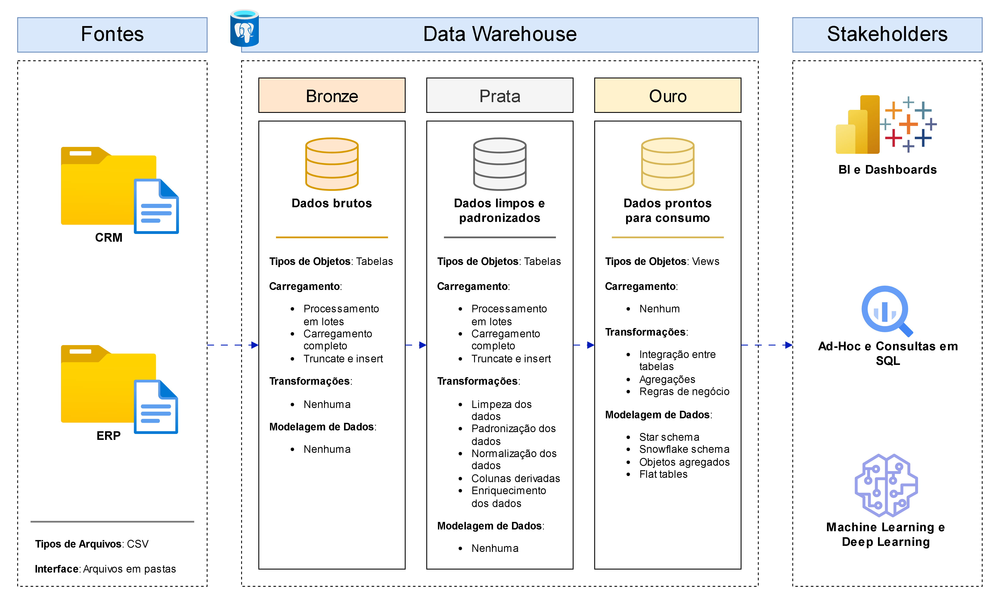

# **Meu primeiro Data Warehouse**

Este projeto tem como objetivo demonstrar boa parte das minhas habilidades práticas de engenharia de dados em um cenário real de construção de um data warehouse.

## :bulb: **Sobre o projeto**

Neste projeto farei a construção de um pipeline moderno e completo, utilizando o PostgreSQL, para consolidar e preparar dados de vendas, possibilitando a elaboração de análises interativas que gerem insights acionáveis. Para atingir este objetivo, listei as principais especificações deste projeto:

- **Fonte dos Dados**: Fazer o *import* de arquivos originados de sistemas comuns de empresas (ERP, CRM, SAP, Intranet e entre outros) em formato CSV;
- **Qualidade dos Dados**: Garantir a alta qualidade dos dados através de limpeza, padronização, normalização e transformação dos dados;
- **Integração**: Fazer a integração de dados de diversas fontes através de uma modelagem de dados, disponibilizando dados de alta qualidade e com regras de negócio aplicadas;
- **Escopo**: Focar somente na versão mais atualizada dos dados. Isto é, não será necessário ter um histórico de dados;
- **Documentação**: Disponibilizar uma documentação clara do projeto para stakeholders.

## 🏗️ **Arquitetura**

Neste projeto será utilizada a Arquitetura de Dados Medalhão, em que são definidas as camadas **Bronze**, **Prata** e **Ouro**:

### **Camadas**

1. **Bronze**: Nesta camada temos os dados brutos, da maneira que vieram da fonte de dados. Basicamente, são arquivos CSV que serão inseridos em uma base de dados do PostgreSQL.
2. **Prata**: Nesta camada faremos a limpeza, padronização e normalização dos dados, criaremos colunas derivadas e faremos um enriquecimento dos dados.
3. **Ouro**: Nesta camada iremos aplicar regras de negócio aos dados, faremos uma modelagem do tipo Star Schema e nos responsabilizamos de preparar os dados para que os stakeholders possam consumir e tirar insights.

## :page_with_curl: **Convenções**

### **Tabelas**

#### **Regras Gerais**

Todas os nomes de tabelas, não importando em qual camada estejam, deverão seguir as seguintes regras:

- Ser em língua portuguesa, exceto na camada bronze;
- Seguir a convenção *snake_case*, que é uma convenção onde todas as letras são minúsculas e a separação de palavras é feita por underscore. A seguir, estão alguns exemplos:
    - `crm_corretores`;
    - `intranet_visitas_assessores`;
- Não utilizar comandos em SQL;
- Não utilizar acentos.

#### **Camada Bronze**

- Todos os nomes de tabelas nesta camada devem seguir a seguintes regras:
    - Começar com o nome do sistema de origem (e.g., `crm` , `intranet`).
    - Finalizar com o nome da tabela no sistema de origem (e.g., se no intranet há uma fonte de dados escrita “Visitas de Assessores”, então esta tabela na camada bronze se chamaria `intranet_visitas_assessores` ).
    - Em síntese, a nomeação de tabelas nesta camada deverão seguir a seguinte ideia `<nome do sistema de origem>_<nome desta fonte de dados neste sistema de origem>`.

#### **Camada Prata**

- Todos os nomes de tabelas nesta camada devem ser exatamente iguais aos da camada bronze.

#### **Camada Ouro**

- Todos os nomes de tabelas nesta camada devem seguir a seguintes regras:
    - Começar com a classificação dela na modelagem de dados (e.g., `fato` , `dim`, `agg`);
    - Finalizar com um nome que descreva bem o conteúdo da tabela (e.g., `corretores`, `visitas`, `vendas`);
    - Alguns exemplos: `fato_vendas`, `dim_corretores`, `dim_calendario`, `dim_fornecedores`, `agg_visitas`, `agg_comercial`, `agg_clientes`.

### **Colunas**

#### **Regras Gerais**

- Todos os nomes de colunas, não importando o tipo de coluna, devem seguir as seguintes regras:
    - Seguir a convenção *snake_case*;
    - Não utilizar comandos em SQL;
    - Não utilizar acentos.

#### **Chave Primária**

- Todos os nomes de colunas de chave primária em tabelas dimensão deverão ter o sufixo `_key`;
- `<nome da tabela>_key`:
    - `<nome da tabela>` se refere ao nome da tabela dimensão;
    - `_key` se refere ao sufixo de chave primária;
    - Exemplos: `clientes_key`, `corretores_key`.

#### **Colunas Técnicas**

- Todos os nomes de colunas técnicas deverão começar com o prefixo `dwh_`, seguido de um nome que descreva bem a coluna;
- `dwh_<nome da coluna>`:
    - `<nome da coluna>` se refere a um nome que descreva bem o papel da coluna;
    - `dwh_` se refere ao prefixo utilizado para colunas com informações técnicas de sistema (e.g., hora da inserção dos dados, data da inserção dos dados);
    - Exemplos: `dwh_hora_carregamento`, `dwh_data_carregamento`.

#### **Procedimentos Armazenados**

- Todos os nomes de procedimentos armazenados, *stored procedures* em inglês, utilizados para carregar os dados deverão começar com o prefixo `load_`, seguido do nome da camada em que os dados estão sendo carregados (e.g., `load_bronze`, `load_prata` ou `load_ouro`)